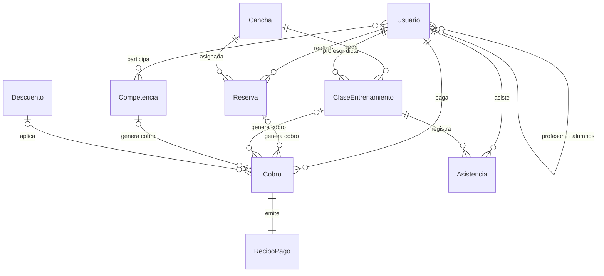

# Plan de Implementación: Backend "Gol Ahora"

Backend Django REST Framework + PostgreSQL para un complejo deportivo.

---

## Decisiones de Diseño Confirmadas

| # | Decisión | Detalle |
|---|---|---|
| 1 | **Usuario → tabla única con `rol`** | Una sola tabla en DB. A nivel código, `Profesor` hereda de `Usuario` (Proxy Model) con atributos propios (`certificacion_deportiva`, `alumnos`) |
| 2 | **Asistencia → tabla intermedia M:N** | Entre `ClaseEntrenamiento` y `Usuario`. Cada alumno tiene un registro por clase |
| 3 | **Profesor.alumnos → M2M** | Relación self-referential en `Usuario`. Un profesor tiene un array de alumnos asignados |
| 4 | **Cobro → cualquier servicio** | Se cobra reserva, inscripción a competencia, clase, etc. El cobro tiene FK nullable a cada fuente |
| 5 | **Competencia** (nombre genérico) | Abarca ligas y torneos. Se crean los modelos, sin API por ahora. Preparado para que un usuario se anote |
| 6 | **Fixture → JSONField** | Objeto JSON flexible |
| 7 | **Timestamps → milisegundos** | En DB se usa `DateTimeField` de Django (timestamp nativo PostgreSQL). En la API se serializa/deserializa como **epoch milliseconds** (int). Nunca strings `dd/mm/aa` |
| 8 | **Descuento → a nivel Cobro** | El descuento se aplica en el cobro, no en el usuario |

---

## Fase 1: Modelado de Base de Datos, PostgreSQL y Migraciones

---

### 1.1 Configuración del Entorno

#### [NEW] [requirements.txt](file:///home/aredes/Documents/Personal/ingeneria_software/gol-ahora-be/requirements.txt)
```
django>=5.1
djangorestframework>=3.15
django-cors-headers>=4.0
psycopg2-binary>=2.9
```

#### [MODIFY] [settings.py](file:///home/aredes/Documents/Personal/ingeneria_software/gol-ahora-be/gol_ahora_back/settings.py)
- `DATABASES` → PostgreSQL con `psycopg2-binary`
- `INSTALLED_APPS` → agregar `rest_framework`, `corsheaders`, y las 5 apps: `authentication`, `fields`, `bookings`, `finance`, `competitions`
- `AUTH_USER_MODEL = 'authentication.Usuario'`
- `LANGUAGE_CODE = 'es-ar'`, `TIME_ZONE = 'America/Argentina/Buenos_Aires'`
- `CORS_ALLOW_ALL_ORIGINS = True` (desarrollo)
- Middleware de CORS

---

### 1.2 App `authentication` — Usuario y Profesor

#### [NEW] authentication/models.py

**Modelo `Usuario`** — extiende `AbstractUser` (hashing de contraseñas, permisos, sesiones de Django built-in):

```python
class Usuario(AbstractUser):
    class Rol(models.TextChoices):
        SOCIO = 'SOCIO', 'Socio'
        EMPLEADO = 'EMPLEADO', 'Empleado'
        ADMINISTRADOR = 'ADMINISTRADOR', 'Administrador'
        PROFESOR = 'PROFESOR', 'Profesor/Entrenador'

    rol = models.CharField(max_length=20, choices=Rol.choices, default=Rol.SOCIO)
    telefono = models.CharField(max_length=20, blank=True)
    direccion = models.CharField(max_length=255, blank=True)
    certificacion_deportiva = models.CharField(max_length=255, blank=True)
    # M2M self-referential: un profesor tiene muchos alumnos asignados
    alumnos = models.ManyToManyField(
        'self', symmetrical=False, blank=True,
        related_name='entrenadores',
        limit_choices_to={'rol': Rol.SOCIO}
    )
    activo = models.BooleanField(default=True)  # Baja lógica
```

**Proxy Model `Profesor`** — herencia sin tabla extra, con manager custom:

```python
class ProfesorManager(models.Manager):
    def get_queryset(self):
        return super().get_queryset().filter(rol=Usuario.Rol.PROFESOR)

class Profesor(Usuario):
    objects = ProfesorManager()

    class Meta:
        proxy = True

    def verificar_certificacion(self):
        return bool(self.certificacion_deportiva)
```

> Polimorfismo: `Profesor` **es un** `Usuario`. En la DB es la misma tabla, diferenciado por `rol`. A nivel código tiene su propia clase con comportamiento especializado.

---

### 1.3 App `fields` — Cancha

#### [NEW] fields/models.py

```python
class Cancha(models.Model):
    class TipoCancha(models.TextChoices):
        FUTBOL_5 = 'FUTBOL_5', 'Fútbol 5'
        FUTBOL_7 = 'FUTBOL_7', 'Fútbol 7'
        FUTBOL_11 = 'FUTBOL_11', 'Fútbol 11'
        PADDLE = 'PADDLE', 'Paddle'
        TENIS = 'TENIS', 'Tenis'

    class TipoSuperficie(models.TextChoices):
        CESPED_SINTETICO = 'CESPED_SINTETICO', 'Césped Sintético'
        CESPED_NATURAL = 'CESPED_NATURAL', 'Césped Natural'
        CEMENTO = 'CEMENTO', 'Cemento'
        POLVO_LADRILLO = 'POLVO_LADRILLO', 'Polvo de Ladrillo'

    numero = models.PositiveIntegerField(unique=True)
    tipo_cancha = models.CharField(max_length=20, choices=TipoCancha.choices)
    superficie = models.CharField(max_length=20, choices=TipoSuperficie.choices)
    capacidad = models.PositiveIntegerField()
    estado_disponibilidad = models.BooleanField(default=True)
    duracion_maxima_reserva = models.PositiveIntegerField(help_text="Minutos")
    precio_base_hora = models.DecimalField(max_digits=10, decimal_places=2)
    activa = models.BooleanField(default=True)  # Baja lógica
```

---

### 1.4 App `bookings` — Reserva, ClaseEntrenamiento, Asistencia

#### [NEW] bookings/models.py

```python
class Reserva(models.Model):
    class EstadoReserva(models.TextChoices):
        PENDIENTE = 'PENDIENTE', 'Pendiente'
        CONFIRMADA = 'CONFIRMADA', 'Confirmada'
        CANCELADA = 'CANCELADA', 'Cancelada'
        COMPLETADA = 'COMPLETADA', 'Completada'

    usuario = models.ForeignKey('authentication.Usuario', on_delete=models.CASCADE, related_name='reservas')
    cancha = models.ForeignKey('fields.Cancha', on_delete=models.CASCADE, related_name='reservas')
    fecha_reserva = models.DateTimeField()        # epoch ms en la API
    hora_inicio = models.DateTimeField()           # epoch ms en la API
    hora_fin = models.DateTimeField()              # epoch ms en la API
    estado = models.CharField(max_length=20, choices=EstadoReserva.choices, default=EstadoReserva.PENDIENTE)
    antelacion_cancelacion = models.PositiveIntegerField(default=24, help_text="Horas de antelación")
    created_at = models.DateTimeField(auto_now_add=True)
    updated_at = models.DateTimeField(auto_now=True)

    class Meta:
        constraints = [
            models.UniqueConstraint(
                fields=['cancha', 'fecha_reserva', 'hora_inicio'],
                name='unique_cancha_fecha_hora'
            )
        ]

class ClaseEntrenamiento(models.Model):
    class TipoClase(models.TextChoices):
        FUNCIONAL = 'FUNCIONAL', 'Funcional'
        FUTBOL = 'FUTBOL', 'Fútbol'
        PADDLE = 'PADDLE', 'Paddle'
        PERSONALIZADO = 'PERSONALIZADO', 'Personalizado'

    profesor = models.ForeignKey(
        'authentication.Usuario', on_delete=models.CASCADE,
        limit_choices_to={'rol': 'PROFESOR'}, related_name='clases_dictadas'
    )
    cancha = models.ForeignKey(
        'fields.Cancha', on_delete=models.SET_NULL,
        null=True, blank=True, related_name='clases'
    )
    horario = models.DateTimeField()               # epoch ms en la API
    maximo_alumnos = models.PositiveIntegerField()
    tipo_clase = models.CharField(max_length=20, choices=TipoClase.choices)
    alumnos = models.ManyToManyField(
        'authentication.Usuario', through='Asistencia',
        related_name='clases_inscriptas', blank=True
    )

class Asistencia(models.Model):
    """Tabla intermedia M:N entre ClaseEntrenamiento y Usuario."""
    class EstadoAsistencia(models.TextChoices):
        PRESENTE = 'PRESENTE', 'Presente'
        AUSENTE = 'AUSENTE', 'Ausente'
        JUSTIFICADO = 'JUSTIFICADO', 'Justificado'

    clase = models.ForeignKey(ClaseEntrenamiento, on_delete=models.CASCADE, related_name='asistencias')
    alumno = models.ForeignKey('authentication.Usuario', on_delete=models.CASCADE, related_name='asistencias')
    fecha = models.DateTimeField(auto_now_add=True)  # epoch ms en la API
    estado_asistencia = models.CharField(
        max_length=20, choices=EstadoAsistencia.choices, default=EstadoAsistencia.AUSENTE
    )

    class Meta:
        unique_together = ['clase', 'alumno']
```

---

### 1.5 App `finance` — Cobro, Descuento, ReciboPago

#### [NEW] finance/models.py

```python
class Descuento(models.Model):
    class TipoDescuento(models.TextChoices):
        PORCENTAJE = 'PORCENTAJE', 'Porcentaje'
        MONTO_FIJO = 'MONTO_FIJO', 'Monto Fijo'

    tipo_descuento = models.CharField(max_length=20, choices=TipoDescuento.choices)
    porcentaje = models.DecimalField(max_digits=5, decimal_places=2)
    descripcion = models.CharField(max_length=255, blank=True)
    activo = models.BooleanField(default=True)

class Cobro(models.Model):
    """Cobro genérico: puede originarse de una reserva, clase, competencia, etc."""
    class MetodoPago(models.TextChoices):
        EFECTIVO = 'EFECTIVO', 'Efectivo'
        TARJETA_DEBITO = 'TARJETA_DEBITO', 'Tarjeta de Débito'
        TARJETA_CREDITO = 'TARJETA_CREDITO', 'Tarjeta de Crédito'
        TRANSFERENCIA = 'TRANSFERENCIA', 'Transferencia'
        MERCADO_PAGO = 'MERCADO_PAGO', 'Mercado Pago'

    class EstadoPago(models.TextChoices):
        PENDIENTE = 'PENDIENTE', 'Pendiente'
        APROBADO = 'APROBADO', 'Aprobado'
        RECHAZADO = 'RECHAZADO', 'Rechazado'

    class TipoServicio(models.TextChoices):
        RESERVA = 'RESERVA', 'Reserva de Cancha'
        CLASE = 'CLASE', 'Clase/Entrenamiento'
        COMPETENCIA = 'COMPETENCIA', 'Inscripción a Competencia'
        OTRO = 'OTRO', 'Otro'

    usuario = models.ForeignKey('authentication.Usuario', on_delete=models.CASCADE, related_name='cobros')
    tipo_servicio = models.CharField(max_length=20, choices=TipoServicio.choices)
    # FKs nullables — solo una se usa según tipo_servicio
    reserva = models.ForeignKey('bookings.Reserva', on_delete=models.SET_NULL, null=True, blank=True, related_name='cobros')
    clase = models.ForeignKey('bookings.ClaseEntrenamiento', on_delete=models.SET_NULL, null=True, blank=True, related_name='cobros')
    competencia = models.ForeignKey('competitions.Competencia', on_delete=models.SET_NULL, null=True, blank=True, related_name='cobros')
    descuento = models.ForeignKey(Descuento, on_delete=models.SET_NULL, null=True, blank=True, related_name='cobros')
    monto = models.DecimalField(max_digits=10, decimal_places=2)
    fecha_cobro = models.DateTimeField(auto_now_add=True)  # epoch ms en la API
    metodo_pago = models.CharField(max_length=20, choices=MetodoPago.choices)
    estado_pago = models.CharField(max_length=20, choices=EstadoPago.choices, default=EstadoPago.PENDIENTE)

class ReciboPago(models.Model):
    cobro = models.OneToOneField(Cobro, on_delete=models.CASCADE, related_name='recibo')
    detalle = models.TextField()
    fecha_emision = models.DateTimeField(auto_now_add=True)  # epoch ms en la API
```

---

### 1.6 App `competitions` — Competencia

#### [NEW] competitions/models.py

```python
class Competencia(models.Model):
    """Entidad genérica que abarca Ligas y Torneos."""
    class TipoCompetencia(models.TextChoices):
        LIGA = 'LIGA', 'Liga'
        TORNEO = 'TORNEO', 'Torneo'
        COPA = 'COPA', 'Copa'

    nombre = models.CharField(max_length=255)
    tipo_competencia = models.CharField(max_length=20, choices=TipoCompetencia.choices)
    fixture = models.JSONField(default=dict, blank=True)
    participantes = models.ManyToManyField(
        'authentication.Usuario', related_name='competencias', blank=True
    )
    activa = models.BooleanField(default=True)
    created_at = models.DateTimeField(auto_now_add=True)
```

> Sin API por ahora. Modelos listos para cuando se necesite.

---

### 1.7 Migraciones y Verificación

```bash
python manage.py makemigrations authentication fields bookings finance competitions
python manage.py migrate
python manage.py createsuperuser
```

---

## Fase 2: Serializers, Views y URLs (API REST)

### Estrategia de Timestamps

Todos los `DateTimeField` se serializan como **epoch milliseconds** (int) usando un campo custom de DRF:

```python
class EpochMillisecondsField(serializers.Field):
    """Serializa DateTimeField como epoch milliseconds."""
    def to_representation(self, value):
        return int(value.timestamp() * 1000)

    def to_internal_value(self, data):
        return datetime.fromtimestamp(int(data) / 1000, tz=timezone.utc)
```

### Endpoints

| Recurso | Método | Endpoint | RF |
|---|---|---|---|
| Usuarios | POST | `/api/auth/usuarios/` | RF-BACK-001 |
| Usuarios | POST | `/api/auth/login/` | RF-BACK-002 |
| Usuarios | POST | `/api/auth/logout/` | RF-BACK-003 |
| Usuarios | GET | `/api/auth/usuarios/{id}/` | RF-BACK-006 |
| Usuarios | PATCH | `/api/auth/usuarios/{id}/` | RF-BACK-004 |
| Usuarios | DELETE | `/api/auth/usuarios/{id}/` | RF-BACK-005 (baja lógica) |
| Profesores | GET | `/api/auth/profesores/` | Listado de profesores con alumnos |
| Canchas | CRUD | `/api/fields/canchas/` | RF-BACK-007 a 010 |
| Reservas | CRUD | `/api/bookings/reservas/` | RF-BACK-011 a 015 |
| Disponibilidad | GET | `/api/bookings/disponibilidad/` | RF-BACK-015 |
| Clases | CRUD | `/api/bookings/clases/` | Gestión de clases |
| Asistencia | CRUD | `/api/bookings/asistencia/` | Control de asistencia |
| Cobros | CRUD | `/api/finance/cobros/` | RF-BACK-016 a 019 |
| Recibos | GET | `/api/finance/recibos/{id}/` | RF-BACK-017 |
| Descuentos | CRUD | `/api/finance/descuentos/` | Gestión de descuentos |

### Lógica de Negocio en ViewSets

- **Reservas:** Validación de no-solapamiento (RF-BACK-012) + verificación de deudas pendientes (RF-BACK-013)
- **Cobros:** Creación automática de `ReciboPago` al aprobar cobro (RF-BACK-017)
- **Canchas:** Filtro por tipo de deporte en el list (RF-BACK-010)
- **Baja de usuario:** Soft delete — pone `activo = False`, no elimina (RF-BACK-005)

---

## Fase 3: Panel de Administración Django

| Modelo | Configuración Admin |
|---|---|
| **Usuario** | Búsqueda por nombre/email, filtros por rol y estado activo, lista editable |
| **Cancha** | Filtros por tipo_cancha, superficie, estado |
| **Reserva** | Filtros por estado, fecha; búsqueda por usuario |
| **ClaseEntrenamiento** | Inline de Asistencia dentro de la clase |
| **Cobro** | Filtros por tipo_servicio, estado_pago, fecha |
| **ReciboPago** | Vista read-only vinculada al cobro |
| **Descuento** | Administración básica |
| **Competencia** | Administración básica, filtro por tipo |

Se crea superusuario para acceder a `/admin/`.

---

## Mapa de Relaciones Final



---

## Estructura de Archivos Final

```
gol-ahora-be/
├── manage.py
├── requirements.txt
├── gol_ahora_back/
│   ├── settings.py
│   ├── urls.py
│   ├── wsgi.py
│   └── asgi.py
├── authentication/
│   ├── models.py          # Usuario, Profesor (proxy)
│   ├── serializers.py     # Fase 2
│   ├── views.py           # Fase 2
│   ├── urls.py            # Fase 2
│   └── admin.py           # Fase 3
├── fields/
│   ├── models.py          # Cancha
│   ├── serializers.py     # Fase 2
│   ├── views.py           # Fase 2
│   ├── urls.py            # Fase 2
│   └── admin.py           # Fase 3
├── bookings/
│   ├── models.py          # Reserva, ClaseEntrenamiento, Asistencia
│   ├── serializers.py     # Fase 2
│   ├── views.py           # Fase 2
│   ├── urls.py            # Fase 2
│   └── admin.py           # Fase 3
├── finance/
│   ├── models.py          # Cobro, ReciboPago, Descuento
│   ├── serializers.py     # Fase 2
│   ├── views.py           # Fase 2
│   ├── urls.py            # Fase 2
│   └── admin.py           # Fase 3
└── competitions/
    ├── models.py          # Competencia
    └── admin.py           # Fase 3
```

---

## Verification Plan

### Automated
```bash
python manage.py makemigrations --check   # Sin migraciones pendientes
python manage.py migrate                  # Ejecuta sin errores
python manage.py test                     # Tests unitarios
```

### Manual
- Django Admin funcional con datos de prueba
- Endpoints testeados con curl/Postman
- Constraints de unicidad verificados
